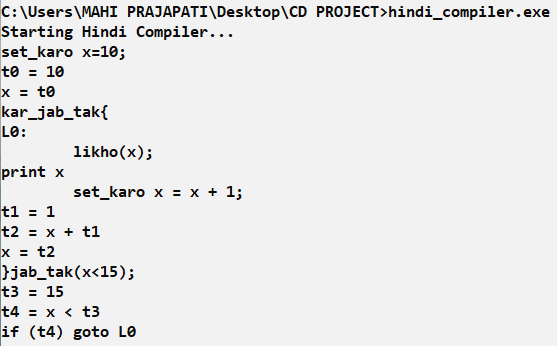

**Hindi Compiler Project**

**Author**
**Name:** Mahi Prajapati  
**Project Title:** Hindi Compiler with Loop Execution and TAC  
**Platform:** C, Flex, Bison, GCC (Windows CMD)

---

## **Description**

This project implements a custom Hindi-language compiler using **Flex** and **Bison**. It supports Hindi-like syntax for programming constructs such as variable assignments, output commands, and loops (`kar_jab_tak`), converting them into **three-address code (TAC)** as intermediate representation. The goal is to provide a regional-language programming experience and demonstrate core compiler construction techniques including lexical analysis, parsing, semantic analysis, and TAC generation.

## **Key Features**

- **Hindi Keywords** for a regional-language programming experience
- **Do-While Loop Support** using `kar_jab_tak` ... `jab_tak` (body runs first, then condition is checked)
- **Arithmetic Handling** (e.g., `x = x + 1;`)
- **Three Address Code (TAC)** generation with temporary variables and labels
- **Console Output** using `likho`

## **Prerequisites**

Make sure the following are installed in your Unix/Linux/WSL environment:

1. **Flex** (Fast Lexical Analyzer): For generating the lexer.
2. **Bison** (GNU Parser Generator): For generating the parser
3. **GCC** (GNU Compiler Collection): For compiling the generated C code
4. A Unix-like environment (Linux, macOS, or WSL on Windows).


## **Compilation Steps**

### 1. Generate Lexer and Parser
```bash
bison -d parser.y
flex lex.l

### 2. Compile the Generated Code:
```bash
gcc lex.yy.c parser.tab.c main.c -o hindi_compiler

### 3. Run the Compiler:
```bash
a.exe

The program will prompt you to enter your Hindi-style code. Type your code and press `Ctrl + Z` followed by `Enter` (to indicate EOF). The compiler will then output the generated Three Address Code (TAC).

## **Notes**
The compiler uses Hindi-style keywords, supports only integer variables and basic arithmetic operations, implements a do-while loop with `kar_jab_tak`, and displays error messages for invalid syntax.

## **Example Input**
```bash
set_karo x = 10;
kar_jab_tak {
  likho(x);
  set_karo x = x + 1;
} jab_tak(x < 15);

## **Example Execution**


The Hindi-language compiler project demonstrates basic compiler construction techniques including lexical analysis, parsing, do-while loop handling, and three-address code generation using Hindi-like syntax.
